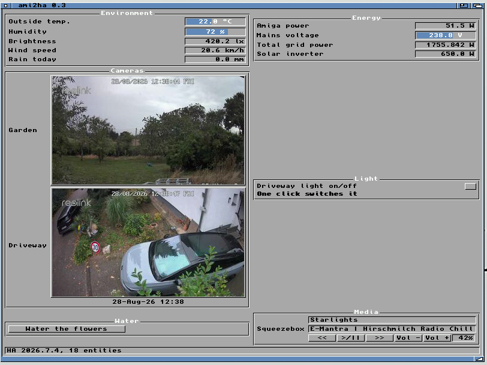

# ami2ha

A native AmigaOS client for [Home Assistant](https://www.home-assistant.io/).

Control your smart home from a real Amiga: read sensors, watch entity states,
flip switches and dimmers — from a fully configurable MUI dashboard, with an
ARexx port so the rest of your Workbench can join in.

<p align="center">
  
</p>

<p align="center">
  <sub>Sensors, gauges, camera snapshots, a toggle, a button and a media
  player — one MUI window on a real Amiga 4000T.</sub>
</p>

> **Status: early, but it works.** Everything below has been run on real
> AmigaOS 3.2 hardware against a live Home Assistant: reading sensors,
> flipping switches, the settings window, the ARexx port, Workbench
> launch, reconnecting after the link drops, HTTPS — verified against a
> local reverse proxy and Home Assistant Cloud — and camera snapshots.
> What is missing is drag-and-drop reordering; see [Roadmap](#roadmap).

## Try it

Grab the release archive, unpack it, and double-click the `Install` icon:

```
lha x ami2ha-0.3.1.lha
```

From a Shell the Installer has to be named in full, since it isn't on the
command path: `SYS:System/Installer Install`. Or skip it entirely — it's one
program, so copying `ami2ha.020` (or `ami2ha.000` on a 68000) where you want
it works just as well.

You will need a long-lived access token from Home Assistant — click your
user name at the bottom left, open the **Security** tab, and create one
under *Long-lived access tokens*. Keep it in a file; never pass it on a
command line, where your shell history would remember it.

The archive contains `ami2ha.guide`, which covers the rest: choosing
which entities appear, the dashboard, the settings window, the ARexx
port, and what to do when something does not work. Open it with
MultiView.

## Target systems

| | |
|---|---|
| **Primary** | AmigaOS 3.x, 68020+, MUI 3.8 or newer, a TCP/IP stack offering `bsdsocket.library` (Roadshow, AmiTCP, Miami) |
| **Minimum** | 68000 builds are produced, but JSON over TCP on a stock A500 will be slow |
| **Portable to** | AmigaOS 4, MorphOS and AROS — the sources avoid OS3-only idioms and use the SDI headers for register and hook conventions |

Memory use follows the size of your *dashboard*, not the size of your Home
Assistant. A dashboard is a list of entities, and ami2ha asks the server for
exactly those via `subscribe_entities` -- measured against a real
installation with 2079 entities, that is **1.3 KB instead of 960 KB**, and
no wasted parsing. A few hundred KB free is comfortable.

## Architecture at a glance

The project is split along one hard line:

```
src/core/     pure C99, no Amiga headers, no OS calls
              -> buffers, JSON reader, Base64, SHA-1, WebSocket framing
              -> HTTP handshake, Home Assistant client, entity store
              -> compiled into BOTH the Amiga binary and the host test runner

src/net/      bsdsocket.library transport, optional AmiSSL
src/ui/       MUI dashboard and the settings window
src/rexx/     ARexx host port
src/main.c    command line front end
```

Everything that can be tested without an Amiga *is* tested without an Amiga.
`make test` compiles `src/core/` with the host compiler and runs the suite in
about a second, so protocol bugs get caught long before an emulator boots.
The same sources are then cross-compiled for m68k unchanged.

A few decisions worth knowing about:

- **The JSON reader builds no document tree.** A `get_states` reply on a large
  installation is a few hundred kilobytes, and a node-per-value DOM would not
  fit comfortably on a 2 MB machine. Callers walk the document once and copy
  out only the fields they need; tokens are slices into the caller's buffer,
  so parsing allocates nothing.
- **Text is transcoded to Latin-1 on the way in.** Home Assistant speaks
  UTF-8; Amiga fonts do not. Codepoints outside Latin-1 are folded to
  sensible ASCII (curly quotes, dashes, `EUR`) rather than rendered as
  mojibake.
- **There is no floating point anywhere.** Numbers are parsed to fixed-point
  integers. A 68000 has no FPU, so `strtod` would mean pulling
  `mathieeedoubbas.library` into every numeric read; the binary depends on
  nothing but `bsdsocket.library` and `dos.library`.
- **The protocol client owns no socket.** It consumes and produces byte
  buffers, so the whole session — upgrade, handshake, auth, subscription,
  state application — is driven by tests with no network involved.

## Building

You need a Mac (Intel or Apple Silicon) or Linux box. One command sets up the
complete cross-toolchain — vbcc, vasm, vlink, the AmigaOS NDK, and the MUI
developer includes — under `~/opt/amiga`, with no root access required:

```sh
./tools/setup-toolchain.sh
```

Then:

```sh
make          # cross-compile build/ami2ha for m68k
make test     # build and run the portable core tests on this machine
```

See [docs/BUILDING.md](docs/BUILDING.md) for toolchain details, CPU and
optimisation options, and how to enable AmiSSL.

## The command line client

The first runnable milestone is a CLI that exercises the whole stack. It is
useful on its own, and scriptable:

```
ami2ha homeassistant.local TOKENFILE=S:ha.token LIST
ami2ha homeassistant.local TOKENFILE=S:ha.token DOMAIN=light LIST
ami2ha homeassistant.local TOKENFILE=S:ha.token GET=sensor.kitchen_temperature
ami2ha homeassistant.local TOKENFILE=S:ha.token TOGGLE=light.kitchen
ami2ha homeassistant.local TOKENFILE=S:ha.token WATCH
```

`WATCH` follows live state changes until Ctrl-C. Prefer `TOKENFILE` over
`TOKEN`: a token on the command line ends up in your shell history and is
visible in the task list.

### Or start it from Workbench

```
ami2ha CONFIG=S:ami2ha.cfg TOKENFILE=S:ha.token WRITEICON
```

writes an icon whose tool types carry those settings, so afterwards the
program can simply be double-clicked -- no Shell involved. Tool types read
on a Workbench start are `CONFIG`, `HOST`, `PORT`, `TOKENFILE`, `LABEL`,
`TLS` and `NOVERIFY`. The last two are switches: what matters is whether
they are present at all.

The icon is written with all of them, the unused ones disabled by the
brackets Workbench understands, so Icons -> Information shows what the
program accepts rather than leaving you to guess:

```
CONFIG=Work:ami2ha/ami2ha.cfg
(HOST=192.168.1.100)
(PORT=8123)
(TOKENFILE=Work:ami2ha/ha.token)
(LABEL=amiga)
(TLS)
(NOVERIFY)
```

Remove the brackets to switch one on. A tool type overrides the
configuration file, so the whole connection can live in the icon if you
prefer, leaving the dashboard layout in the file where a list of entities
is easier to edit.

## The dashboard

Widgets are bound to entities explicitly, one per line, so a dashboard is a
readable file you can diff and share:

```
group "Wohnzimmer"
    sensor sensor.wz_temperatur label "Temperatur"
    gauge  sensor.wz_co2 label "CO2" min 400 max 2000
    toggle light.wohnzimmer label "Licht"
end

group "Szenen"
    button scene.turn_on entity scene.gute_nacht label "Gute Nacht"
end
```

You should not have to type two hundred entity IDs, so generate a starting
point from your own instance and prune it:

```
ami2ha homeassistant.local TOKENFILE=S:ha.token WRITECONFIG=S:ami2ha.cfg
ami2ha CONFIG=S:ami2ha.cfg GUI
```

Right-click a camera tile for **Save snapshot**, which keeps the frame that is
on screen. Files are named after the tile's label and the time, so a camera
labelled `Einfahrt` saves as `Einfahrt-20260828-102900.jpg`. Snapshots go to
`PROGDIR:snapshots` unless the configuration says otherwise:

```
savedir    Work:ami2ha-shots
```

Widget kinds are `sensor`, `toggle`, `gauge`, `button`, `text`, `camera`,
`media`, `dimmer`, `color` and `cover`.

A `dimmer` puts a light's brightness on a slider, a `color` gives an RGB light
red, green and blue, and a `cover` drives a blind or shutter:

```
group "Licht"
    dimmer light.wohnzimmer label "Wohnzimmer"
    color  light.strip      label "LED Strip"
end

group "Rollladen"
    cover cover.kueche label "Küche"
end
```

A dimmer reads `-` rather than `0%` when the lamp is off, because a lamp that
is off reports no brightness at all and 0% would claim someone had dimmed it
right down. A colour control stays greyed out until the light is on and
reports a colour: an off lamp has no colour to show, and a control that
invented one would push it to the light the moment the window opened. A cover
shows its position where it has one, and open/opening/closed otherwise.

Dragging a slider sends one command when you let go, not one per pixel.

A `media` line gives a media player its transport:

```
group "Musik"
    media media_player.squeezebox label "Squeezer"
end
```

which shows what is playing -- artist, title, station and volume, whichever of
them Home Assistant is sending -- over a row of buttons for previous,
play/pause, next and volume. See
[examples/dashboard.cfg](examples/dashboard.cfg) for a worked example.

You do not have to edit the file, though: **Project → Settings…** opens a
window where you pick which of the available entities appear, put them in
groups, name the groups, order them, and set how each is shown -- the range
for a gauge, a camera's size and refresh interval, and how many group boxes
sit side by side (`columns`). Save writes the file back, Use applies the
change without writing it.

Note that MUI's cycle gadgets open a popup menu: press and hold, then
release over the entry you want.

### Or choose the entities in Home Assistant

Rather than listing them, tag entities with a label in Home Assistant and
point ami2ha at it:

```
host       homeassistant.local
tokenfile  S:ha.token
label      amiga
```

For an `https://` server add `tls yes` (and `tlsverify no` if the
certificate is self-signed).

### Cameras

A camera entity becomes a tile showing a snapshot — a still, not video.
Click it to fetch a new one, or give it a refresh interval:

```
group "Hof"
    camera camera.einfahrt label "Einfahrt" width 320 height 180 refresh 300
end
```

`width` and `height` are what ami2ha asks Home Assistant for, and it scales
server-side: 320×180 is about 6 KB against 31 KB for a camera's native frame,
so they decide the transfer *and* the decoding. Both are required — a width
alone is silently ignored. `timestamp no` drops the caption showing when the
picture arrived.

Snapshots come over plain HTTP from `/api/camera_proxy` on a second,
short-lived connection, so a camera that is slow or broken cannot disturb the
live dashboard — which matters, because battery cameras routinely take ten
seconds to answer and refuse the first request while they wake.

This is the one feature with an extra dependency: a **JPEG datatype** must be
installed, since Home Assistant serves camera stills as JPEG and there is no
other format to ask for. Nothing else in ami2ha needs one.

Everything carrying that label appears on the Amiga, named by its friendly
name, with the widget kind inferred from its domain. Add a label in the HA
UI and it turns up on the next start -- no file to edit on the Amiga.

This asks Home Assistant to do the filtering with a rendered template. The
obvious alternative, reading the entity registry, measured **2.4 MB** on a
real installation -- more than the WebSocket message cap and far more than
an Amiga can hold. The template answer was **164 bytes**.

The window updates from the WebSocket push, so readings change by
themselves without polling. While idle the application uses no CPU at all:
MUI hands its signal mask to `WaitSelect`, so one `Wait()` covers the GUI,
the socket and Ctrl-C together.

## Connecting

ami2ha talks to Home Assistant's
[WebSocket API](https://developers.home-assistant.io/docs/api/websocket) using
a long-lived access token, which you create under your Home Assistant profile.
The WebSocket API pushes state changes, so the Amiga is not polling.

The link is watched rather than assumed: ami2ha pings every 30 seconds and,
if nothing answers within 90, says the connection is gone instead of showing
this morning's values indefinitely. **Project → Reconnect** (right-Amiga R)
forces a fresh connection at any time — which is also how you pick up an
entity you have only just labelled in Home Assistant, since the entity list is
requested when the connection is made. If the *first* connection fails, a
requester says why and offers Retry, so a Workbench launch does not simply
exit without explanation.

By default the connection is plain HTTP and is intended for use on your own
LAN. **Your access token is sent in cleartext in that mode** — anyone able to
observe your local network can read it.

Add `TLS` for an `https://` server, via
[AmiSSL](https://github.com/jens-maus/amissl) 5:

```
ami2ha myhouse.example.com TLS TOKENFILE=S:ha.token LIST
```

The port then defaults to 443 rather than 8123. The certificate is checked
against the trusted roots *and* against the host name you asked for —
checking the chain alone would accept any valid certificate for any site.
A self-signed certificate needs `NOVERIFY` as well, which keeps the traffic
encrypted but stops proving who is answering; do that only on a network you
trust. A build without AmiSSL refuses `TLS` outright rather than quietly
falling back to cleartext.

On a LAN this mostly is not worth the seconds it costs a 68k. It earns its
keep reaching the house from outside, which is exactly when the token would
otherwise cross networks you do not control — Home Assistant Cloud
(`ui.nabu.casa`) works, and its certificate verifies without `NOVERIFY`.

Two things catch people out, both covered in the manual: a reverse proxy
usually picks its certificate from the name you asked for and may refuse a
bare IP address, and AmigaOS has no mDNS, so a `.local` name needs a line in
`DEVS:Internet/hosts`.

## ARexx

ami2ha hosts an `AMI2HA` port so the rest of your Workbench can read values
and issue commands:

```rexx
/* every ARexx script must start with a comment */
OPTIONS RESULTS
ADDRESS AMI2HA

GET sensor.kitchen_temperature
SAY 'kitchen is' RESULT

ON switch.workshop_outlet
```

Arguments need no quoting — ARexx uppercases them and ami2ha folds them
back. See [docs/AREXX.md](docs/AREXX.md) for the full command set.

## Roadmap

- [x] Cross-toolchain setup, reproducible from one script
- [x] Build system, host test harness
- [x] Portable core: buffers, JSON reader, Base64, SHA-1, WebSocket framing
- [x] `bsdsocket.library` transport, non-blocking, driven by `WaitSelect`
- [x] HTTP/1.1 upgrade and WebSocket handshake verification
- [x] Home Assistant client: authentication, `subscribe_events`, `get_states`, `call_service`
- [x] Entity store
- [x] Command line client (`LIST`, `GET`, `WATCH`, `TOGGLE`, `ON`, `OFF`)
- [x] Dashboard configuration format, parser and generator
- [x] MUI dashboard: sensors, gauges, toggles, buttons, live updates
- [x] Choose entities from within Home Assistant, by label
- [x] Settings window: groups, choose entities, reorder, save
- [x] HTTPS via AmiSSL, with certificate and host name verification
- [x] Camera snapshots as dashboard tiles, scaled server-side
- [x] Media player rows: what is playing, transport and volume
- [ ] Drag-and-drop reordering (nice-to-have; Up/Down works today)
- [x] Reconnect handling and connection status UI
- [x] ARexx host port
- [x] Optional AmiSSL support
- [x] Workbench launch via icon tool types (WRITEICON)
- [x] Installer, AmigaGuide manual, release archive

## Contributing

Contributions are very welcome — see [CONTRIBUTING.md](CONTRIBUTING.md).
Especially useful right now: testing on real hardware and on
AmigaOS 4 / MorphOS / AROS, and anything that reduces memory use.

## License

MIT — see [LICENSE](LICENSE).

The bundled SDI headers in `include/SDI/` are public domain, from the
[adtools/SDI](https://github.com/adtools/SDI) project.
